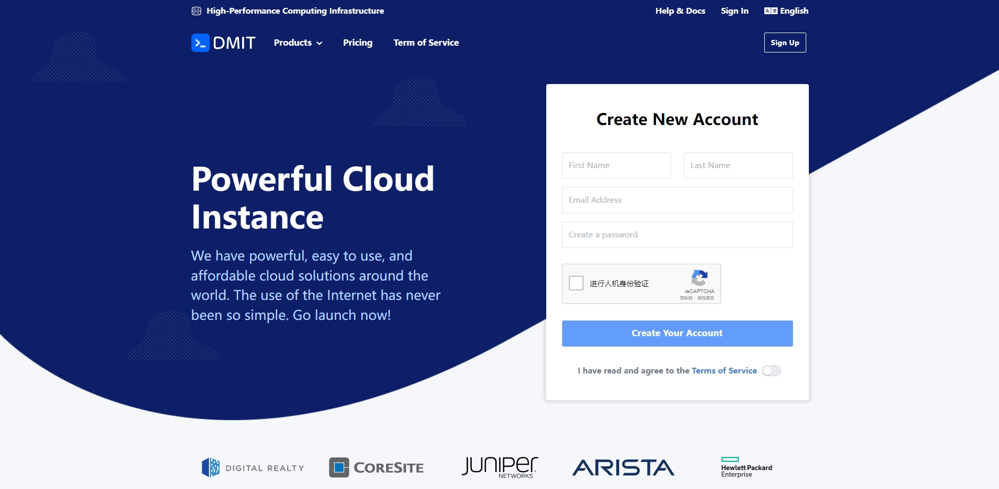
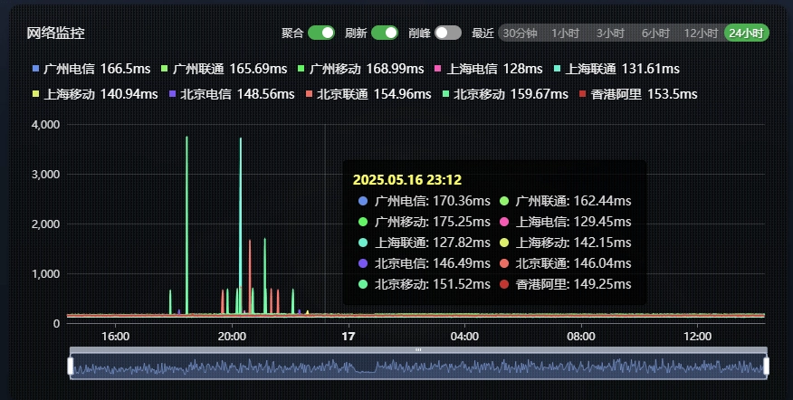
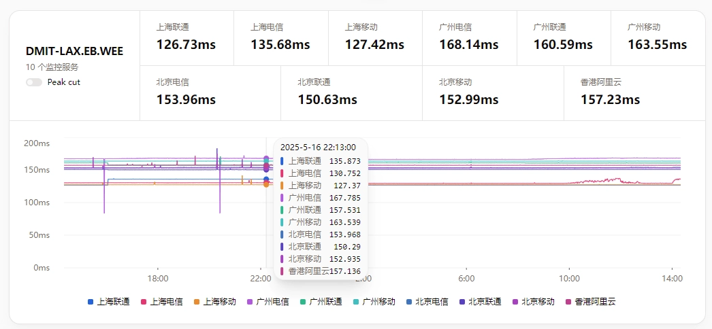
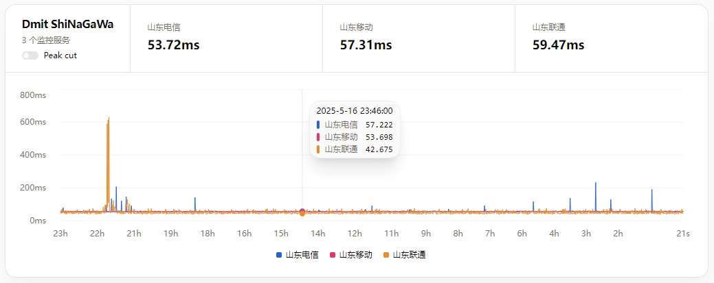

# DMIT VPS：高端优化线路服务商，稳定低延迟的网络体验

---

如果你正在寻找一台连接稳定、延迟够低的VPS，可能已经被市面上各种"优化线路"搞得晕头转向。有的商家说自己线路好，结果晚高峰直接掉线；有的价格便宜，但硬件配置像上个世纪的产物。DMIT（大家都叫它"大妈"）就是在这种环境下杀出来的——专注高性能VPS，硬件扎实，线路优化到位，尤其适合那些对网络质量有要求的用户。

---

DMIT成立于2017年，虽然年头不算长，但在圈内口碑一直不错。它是搬瓦工（Bandwagonhost）的上游之一——这意味着它的网络资源质量是有保障的。跟那些靠低价走量的商家不同，DMIT走的是"高端精品"路线：硬件配置舍得堆料，网络线路舍得花钱优化。

## 为什么选DMIT？几个实在的理由

**硬件够硬**  
AMD EPYC处理器 + NVMe SSD存储，这套配置放在VPS行业里算是顶配了。处理器性能强劲，硬盘读写速度快，适合跑各种对IO要求高的应用。

**线路优化到位**  
核心节点覆盖洛杉矶、香港、东京，接入CN2 GIA、CMIN2、9929等优化线路。如果你在国内，这些线路名称应该不陌生——它们代表着更低的延迟和更稳定的连接。DMIT美西CN2产品的网络监控图基本是一条直线，这种稳定性在行业里真的不多见。

**故障补偿够爽快**  
提供99%的SLA可用性保障。更重要的是，多数国内优化线路产品每15天可以免费更换一次IP（搬瓦工同类产品换一次IP要8.79美元）。如果你买的IP不幸被墙了，这个功能就太实用了。

**退款政策人性化**  
3天内且流量用量低于30GB可以无条件退款，30天内可以按剩余价值退款。这给了你足够的时间测试服务质量，而不是交钱后发现不合适也没法退。

## 美国洛杉矶VPS：性价比之选

### Premium系列 - 三网CN2 GIA回程

这是DMIT的代表产品线，三网（电信、联通、移动）回程都走CN2 GIA，保障优化线路。

- **LAX.Pro.WEE**：1核1G内存20G硬盘，500G流量（500Mbps带宽）- $39.9/年【活动款缺货】
- **LAX.Pro.MALIBU**：1核1G内存20G硬盘，1TB流量（1Gbps带宽）- $49.9/年【活动款缺货】
- **LAX.Pro.TINY**：1核2G内存20G硬盘，1TB流量（1Gbps带宽）- $9.9/月、$88.88/年【[查看详情](https://www.dmit.io/aff.php?aff=13832)】
- **LAX.Pro.PalmSpring**：2核2G内存40G硬盘，2TB流量（2Gbps带宽）- $100/年【活动款缺货】
- **LAX.Pro.POCKET**：2核2G内存40G硬盘，1.5TB流量（4Gbps带宽）- $14.9/月、$159.98/年【[查看详情](https://www.dmit.io/aff.php?aff=13832)】
- **LAX.Pro.STARTER**：2核2G内存80G硬盘，3TB流量（10Gbps带宽）- $29.9/月、$322.99/年【[查看详情](https://www.dmit.io/aff.php?aff=13832)】

**测速节点**：https://lg.dmit.sh/?server=1

美西三网优化线路的标杆产品之一。从监控图可以看出，线路全天波动极小，几乎就是一条直线。这种稳定性意味着你不用担心晚高峰突然卡顿，也不用半夜起来看服务器是不是又炸了。对于需要长期稳定运行服务的用户来说，这点很重要。

### Eyeball系列 - 电信联通9929 & 移动CMIN2

这个系列价格比Premium便宜一些，线路优化程度稍低，但整体表现依然出色。

- **LAX.EB.INTRO**：1核1G内存10G硬盘，500G流量（1Gbps带宽）- $29.9/年【活动款缺货】
- **LAX.EB.WEE**：1核1G内存20G硬盘，1TB流量（1Gbps带宽）- $39.9/年【活动款缺货】
- **LAX.EB.CORONA**：1核1G内存20G硬盘，2TB流量（2Gbps带宽）- $49.9/年【活动款缺货】
- **LAX.EB.TINY**：1核2G内存20G硬盘，1.5TB流量（2Gbps带宽）- $9.9/月、$88.88/年【[查看详情](https://www.dmit.io/aff.php?aff=13832)】
- **LAX.EB.FONTANA**：2核2G内存40G硬盘，4TB流量（4Gbps带宽）- $100/年【活动款缺货】
- **LAX.EB.POCKET**：2核2G内存40G硬盘，3TB流量（4Gbps带宽）- $14.9/月、$159.98/年【[查看详情](https://www.dmit.io/aff.php?aff=13832)】
- **LAX.EB.STARTER**：2核2G内存80G硬盘，5TB流量（10Gbps带宽）- $29.9/月、$322.99/年【[查看详情](https://www.dmit.io/aff.php?aff=13832)】

**测速节点**：https://lg.dmit.sh/?server=2

EB系列的定位很有意思：电信稍微差一点点（但也不算差），联通移动直接用上了各自的顶级优化线路。要是电信也换成CN2 GIA，那就直接背刺Premium系列了——但那样价格肯定也得往上调。现在这个定位其实挺好，预算有限又想要不错体验的用户可以考虑。

### Premium Secure系列 - CloudFlare去程 + 三网CN2 GIA回程

这是少有的"高防+优化线路"组合产品，适合建站用户。

- **LAX.sPro.Fixed**：2核2G内存40G硬盘，1TB流量（300Mbps带宽）- $139/年【活动款缺货】
- **LAX.sPro.CREATOR**：2核2G内存20G硬盘，1.5TB流量（100Mbps带宽）- $71.99/季、$259.99/年【[查看详情](https://www.dmit.io/aff.php?aff=13832)】

去程走CloudFlare，提供5T DDoS防护能力（实际效果可能达不到这个级别，但整体防护还是不错的）。回程依然是三网CN2 GIA优化。如果你在跑网站，尤其是面向国内用户的站点，这个系列值得考虑。👉 [建站用户的不二之选](https://www.dmit.io/aff.php?aff=13832)

⚠️ 不过要注意，这个系列可能要逐步淘汰了（官方在9月底发布了相关通知）。

## 日本东京VPS：低延迟首选

### Premium系列 - 三网CN2 GIA回程

日本机房离国内更近，延迟比美国洛杉矶要低不少。

- **TYO.Pro.Shinagawa**：1核2G内存60G硬盘，500G流量（500Mbps带宽）- $199/年【活动款缺货】
- **TYO.Pro.TINY**：1核1G内存20G硬盘，500G流量（1Gbps带宽）- $21.9/月、$262.8/年【[查看详情](https://www.dmit.io/aff.php?aff=13832)】
- **TYO.Pro.STARTER**：1核2G内存40G硬盘，1TB流量（1Gbps带宽）- $39.9/月、$478.8/年【[查看详情](https://www.dmit.io/aff.php?aff=13832)】

**测速节点**：https://lg.dmit.sh/?server=8

这是目前市面上最顶级的日本优化线路产品之一。当然，价格也相当"顶级"。如果你对延迟要求极高（比如跑游戏服务器、实时通讯类应用），东京机房会是更好的选择。

### Eyeball系列 - 三网CMI直连回程

- **TYO.EB.WEE**：1核1G内存20G硬盘，1TB流量（1Gbps带宽）- $189/年【活动款缺货】
- **TYO.EB.TINY**：1核1G内存20G硬盘，1TB流量（1Gbps带宽）- $25.9/月、$310.8/年【[查看详情](https://www.dmit.io/aff.php?aff=13832)】
- **TYO.EB.STARTER**：1核2G内存40G硬盘，2TB流量（2Gbps带宽）- $55.9/月、$670.8/年【[查看详情](https://www.dmit.io/aff.php?aff=13832)】

移动用户体验优秀。电信联通走CMI会有跨运营商QoS限速，速度稍差一些。如果你是移动用户，这个系列性价比还不错。

## 中国香港VPS：回国专线

### Premium系列 - 三网CN2 GIA回程

- **HKG.Pro.VICTORIA**：1核2G内存60G硬盘，800G流量（500Mbps带宽）- $298.88/年【活动款缺货】
- **HKG.Pro.TINY**：1核1G内存20G硬盘，400G流量（1Gbps带宽）- $39.9/月、$478.8/年【[查看详情](https://www.dmit.io/aff.php?aff=13832)】

可以说是最顶级的回国优化线路了。香港离大陆近，延迟极低，线路又是CN2 GIA优化。当然，这个价格也确实不便宜。

### Eyeball系列 - 三网CMI直连回程

- **HKG.EB.WEEv2**：1核1G内存20G硬盘，450G流量（500Mbps带宽）- $179.9/年【活动款缺货】
- **HKG.EB.TINYv2**：1核1G内存20G硬盘，1TB流量（1Gbps带宽）- $29.9/月、$358.8/年【[查看详情](https://www.dmit.io/aff.php?aff=13832)】

移动用户表现优秀，电信联通由于CMI跨运营商QoS问题速度稍差。性价比不如搬瓦工的HK85机房产品（同样是三网CMI回程，但价格更低）。

## Tier 1系列：国际线路产品

DMIT少有的非优化线路产品，未针对中国大陆进行网络优化，主要适用于亚太或欧美地区的国际互联需求。流量为单向计算，超量后限速50-100Mbps但不限量。

- **香港 HKG.T1.WEE**：1核1G内存20G硬盘，1TB流量（4Gbps带宽）- $36.9/年【[查看详情](https://www.dmit.io/aff.php?aff=13832)】
- **日本 TYO.T1.WEE**：1核1G内存20G硬盘，1TB流量（4Gbps带宽）- $36.9/年【[查看详情](https://www.dmit.io/aff.php?aff=13832)】
- **美国 LAX.T1.WEE**：1核1G内存20G硬盘，1TB流量（4Gbps带宽）- $36.9/年【[查看详情](https://www.dmit.io/aff.php?aff=13832)】

如果你的业务主要面向海外用户，不需要针对国内优化，这个系列价格便宜很多。

---

## 总结：DMIT适合什么人？

DMIT主打高端优化线路VPS，硬件强悍、线路稳定。美国洛杉矶的优化产品性价比很高，价格虽然比搬瓦工稍贵，但换来的是更新的硬件、免费换IP服务、更高的故障补偿。

适合追求低延迟、高稳定性的用户，无论是跨境电商、网站部署、游戏加速还是中小型业务承载，都是理想选择。如果你正在寻找一台"不用半夜起来重启、不用担心晚高峰掉线"的VPS，👉 [DMIT值得一试](https://www.dmit.io/aff.php?aff=13832)。
